# 🏗️ SƠ ĐỒ KIẾN TRÚC HỆ THỐNG - WEB HỌC TIẾNG ANH

> **English Learning Platform** - System Architecture Documentation  
> **Version:** 1.0.0  
> **Last Updated:** March 2, 2026

---

## 📋 MỤC LỤC

1. [Tổng Quan Kiến Trúc](#1-tổng-quan-kiến-trúc)
2. [Kiến Trúc Backend Chi Tiết](#2-kiến-trúc-backend-chi-tiết)
3. [Database Schema & Relationships](#3-database-schema--relationships)
4. [API Request Flow](#4-api-request-flow)
5. [Module Chính & Chức Năng](#5-module-chính--chức-năng)
6. [Security Architecture](#6-security-architecture)
7. [Data Flow Diagrams](#7-data-flow-diagrams)

---

## 1. TỔNG QUAN KIẾN TRÚC

### 1.1. Sơ Đồ Tổng Quan Hệ Thống

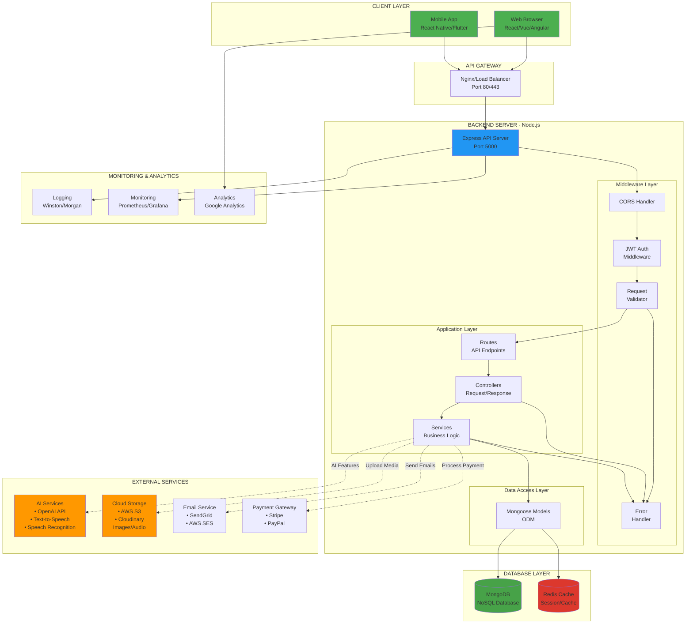

### 1.2. Technology Stack

| Layer | Technology | Purpose |
|-------|-----------|---------|
| **Frontend** | React/Vue/Angular | User Interface |
| **Mobile** | React Native/Flutter | Mobile App |
| **Backend** | Node.js + Express + TypeScript | REST API Server |
| **Database** | MongoDB | Primary Data Storage |
| **Cache** | Redis | Session & Cache |
| **Authentication** | JWT | Stateless Auth |
| **File Storage** | AWS S3 / Cloudinary | Images & Audio |
| **AI Services** | OpenAI / Google Cloud AI | AI Features |
| **Deployment** | Docker + AWS/Heroku | Cloud Hosting |

---

## 2. KIẾN TRÚC BACKEND CHI TIẾT

### 2.1. Layered Architecture (3-Tier)

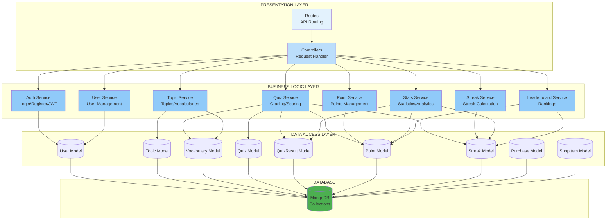

### 2.2. Folder Structure

```
backend/
│
├── src/
│   ├── server.ts                 # Entry Point
│   │
│   ├── config/                   # Configuration Module
│   │   ├── database.ts           # MongoDB Connection
│   │   ├── cors.ts              # CORS Settings
│   │   └── environment.ts        # Environment Variables
│   │
│   ├── models/                   # Data Models (ODM)
│   │   ├── user.model.ts
│   │   ├── topic.model.ts
│   │   ├── vocabulary.model.ts
│   │   ├── quiz.model.ts
│   │   ├── quizResult.model.ts
│   │   ├── point.model.ts
│   │   ├── streak.model.ts
│   │   ├── streakLog.model.ts
│   │   ├── userProgress.model.ts
│   │   ├── shopItem.model.ts
│   │   └── purchase.model.ts
│   │
│   ├── controllers/              # Request Handlers
│   │   ├── auth.controller.ts
│   │   ├── user.controller.ts
│   │   ├── topic.controller.ts
│   │   └── quiz.controller.ts
│   │
│   ├── services/                 # Business Logic
│   │   ├── auth.service.ts
│   │   ├── user.service.ts
│   │   ├── topic.service.ts
│   │   ├── quiz.service.ts
│   │   ├── point.service.ts
│   │   ├── streak.service.ts
│   │   ├── stats.service.ts
│   │   └── leaderboard.service.ts
│   │
│   ├── middlewares/              # Middleware Functions
│   │   └── auth.middleware.ts    # JWT Verification
│   │
│   ├── routes/v1/                # API Routes
│   │   ├── index.ts             # Route Aggregator
│   │   ├── auth.route.ts
│   │   ├── user.route.ts
│   │   ├── topic.route.ts
│   │   └── quiz.route.ts
│   │
│   ├── utils/                    # Utility Functions
│   │   ├── algorithms.ts
│   │   ├── constants.ts
│   │   └── sorts.ts
│   │
│   └── docs/                     # Documentation
│       ├── QUIZ_SYSTEM_GUIDE.md
│       ├── ADVANCED_FEATURES.md
│       ├── FRONTEND_INTEGRATION.md
│       └── SYSTEM_ARCHITECTURE.md
│
├── package.json
├── tsconfig.json
└── .env
```

---

## 3. DATABASE SCHEMA & RELATIONSHIPS

### 3.1. Entity Relationship Diagram

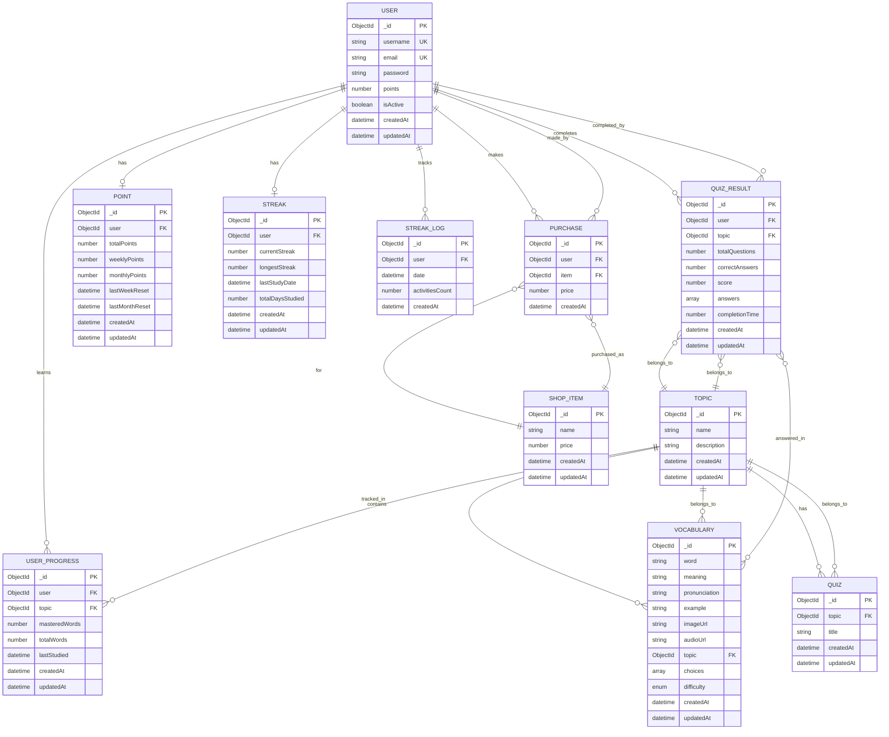

### 3.2. Database Indexes Strategy

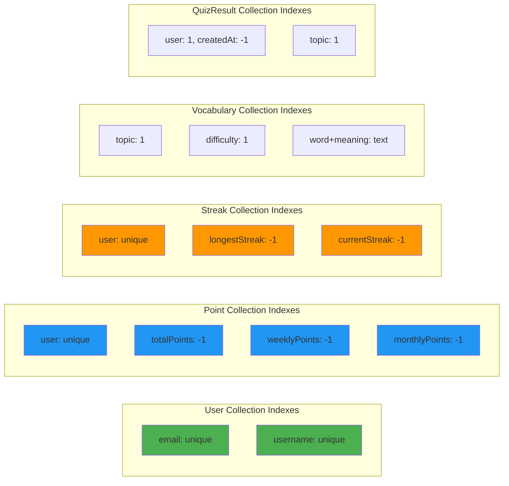

---

## 4. API REQUEST FLOW

### 4.1. Authentication Flow

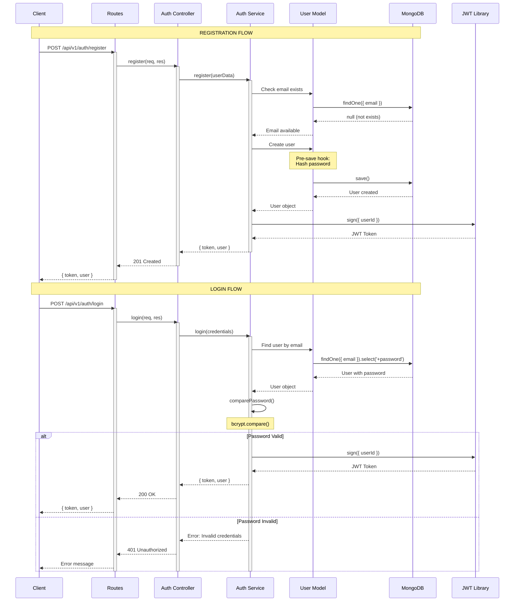

### 4.2. Protected API Request Flow

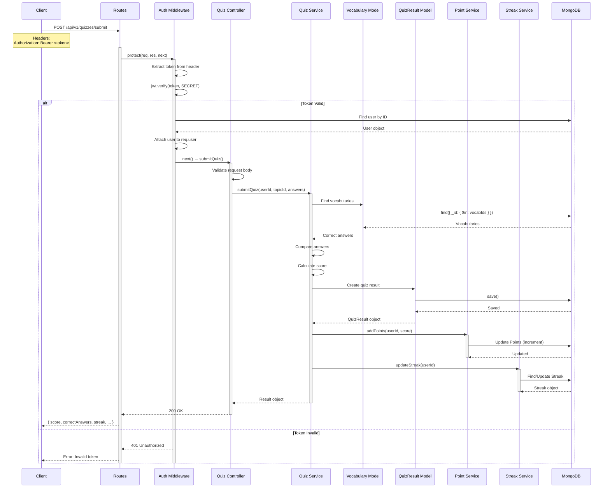

### 4.3. Quiz Taking Complete Flow

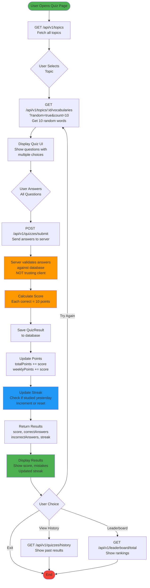

---

## 5. MODULE CHÍNH & CHỨC NĂNG

### 5.1. Authentication Module

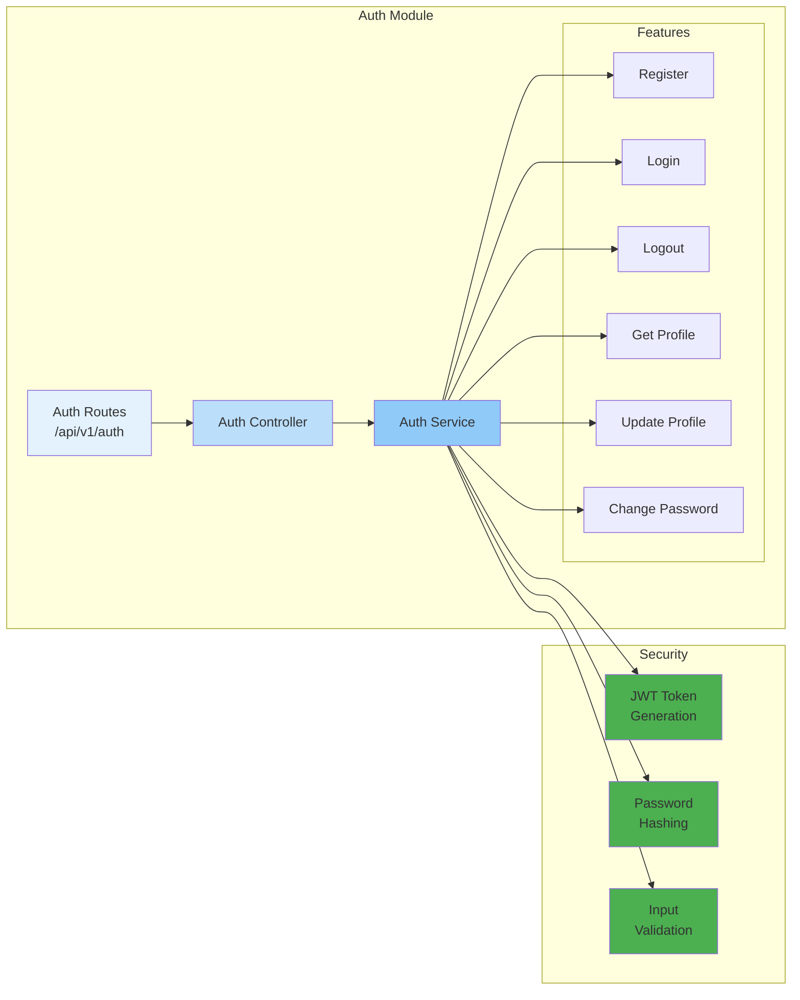

**Chức năng chi tiết:**

1. **Register (Đăng ký)**
   - Validate email format, password strength
   - Check email/username uniqueness
   - Hash password với bcrypt (10 rounds)
   - Create user trong database
   - Generate JWT token (expires 7 days)
   - Return token + user info

2. **Login (Đăng nhập)**
   - Find user by email
   - Verify password với bcrypt.compare()
   - Generate new JWT token
   - Return token + user info

3. **Get Profile (Lấy thông tin)**
   - Verify JWT token (middleware)
   - Fetch user from database
   - Return user info (exclude password)

4. **Change Password (Đổi mật khẩu)**
   - Verify current password
   - Validate new password
   - Hash new password
   - Update database

---

### 5.2. Quiz System Module

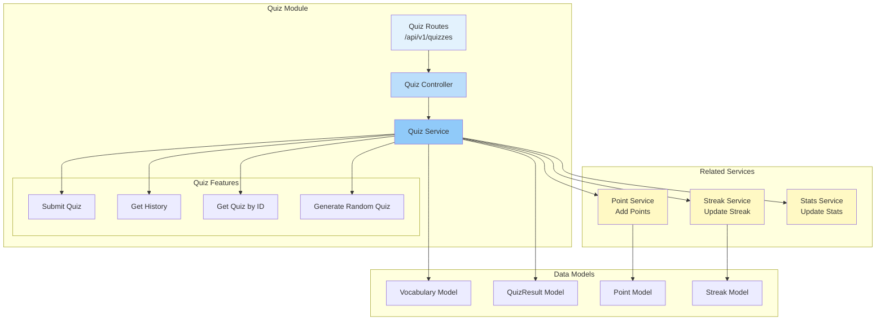

**Chức năng chi tiết:**

1. **Submit Quiz**
   ```
   Input: userId, topicId, answers[]
   
   Process:
   ① Fetch correct answers from Vocabulary collection
   ② Compare user answers with correct answers
   ③ Calculate score (10 points per correct answer)
   ④ Save QuizResult to database
   ⑤ Call PointService.addPoints()
   ⑥ Call StreakService.updateStreak()
   ⑦ Return detailed results
   
   Output: {
     totalQuestions, correctAnswers, score,
     incorrectAnswers[], pointsEarned,
     streak: { current, longest }
   }
   ```

2. **Get Quiz History**
   ```
   Input: userId, page, limit
   
   Process:
   ① Query QuizResult collection by userId
   ② Populate topic info
   ③ Sort by createdAt DESC
   ④ Apply pagination
   
   Output: {
     results[],
     pagination: { page, limit, total, totalPages }
   }
   ```

---

### 5.3. Points & Gamification Module

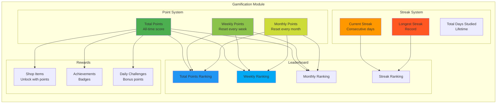

**Point System Logic:**

```javascript
// When user completes quiz:
const score = correctAnswers * 10

await Point.findOneAndUpdate(
  { user: userId },
  { 
    $inc: { 
      totalPoints: score,      // Tích lũy mãi mãi
      weeklyPoints: score,     // Reset mỗi thứ 2
      monthlyPoints: score     // Reset đầu tháng
    }
  },
  { upsert: true }
)
```

**Streak Calculation Logic:**

```javascript
const today = new Date().setHours(0,0,0,0)
const lastStudy = streak.lastStudyDate.setHours(0,0,0,0)

if (isToday(lastStudy)) {
  // Already studied today, no change
  return streak
}

if (isYesterday(lastStudy)) {
  // Studied yesterday → increment
  streak.currentStreak++
} else {
  // Break in streak → reset
  streak.currentStreak = 1
}

if (streak.currentStreak > streak.longestStreak) {
  streak.longestStreak = streak.currentStreak
}

streak.totalDaysStudied++
streak.lastStudyDate = today
```

---

### 5.4. Statistics & Analytics Module

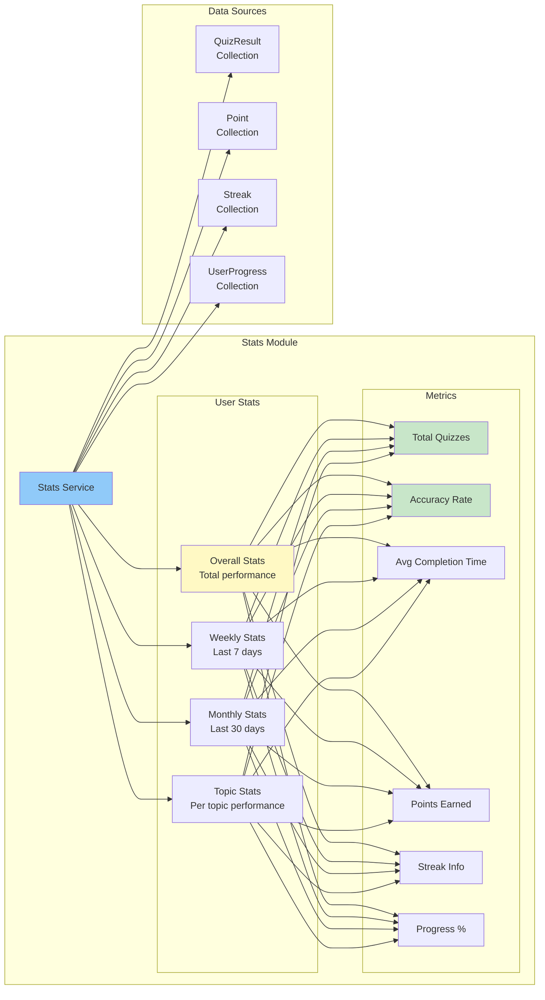

**Stats Calculation Example:**

```javascript
// Overall Stats
const stats = await QuizResult.aggregate([
  { $match: { user: userId } },
  {
    $group: {
      _id: null,
      totalQuizzes: { $sum: 1 },
      totalQuestions: { $sum: '$totalQuestions' },
      totalCorrect: { $sum: '$correctAnswers' },
      avgTime: { $avg: '$completionTime' }
    }
  }
])

const accuracy = (totalCorrect / totalQuestions) * 100
```

---

### 5.5. Topic & Vocabulary Module

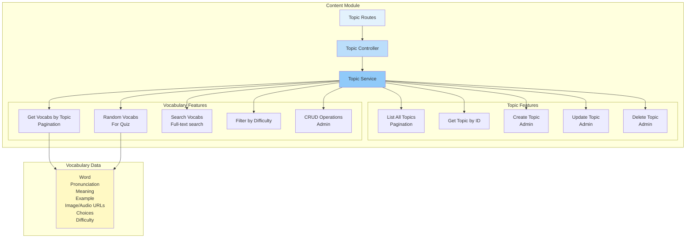

**Random Vocabulary Selection (For Quiz):**

```javascript
// Random 10 words from a topic
const vocabularies = await Vocabulary.aggregate([
  { $match: { topic: topicId } },
  { $sample: { size: 10 } }  // MongoDB random sampling
])

// Generate choices for multiple choice
for (let vocab of vocabularies) {
  // Get 3 random wrong answers
  const wrongChoices = await Vocabulary.aggregate([
    { 
      $match: { 
        topic: topicId,
        _id: { $ne: vocab._id }
      }
    },
    { $sample: { size: 3 } },
    { $project: { meaning: 1 } }
  ])
  
  vocab.choices = wrongChoices.map(c => c.meaning)
}
```

---

## 6. SECURITY ARCHITECTURE

### 6.1. Authentication & Authorization Flow

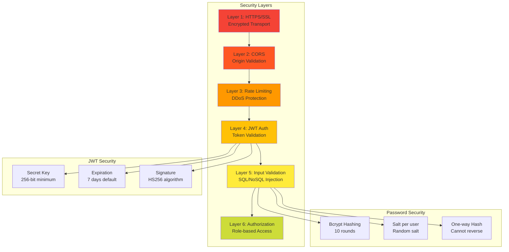

### 6.2. JWT Token Structure

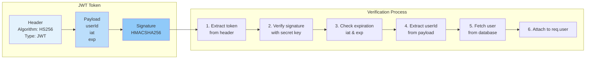

### 6.3. Data Validation & Sanitization

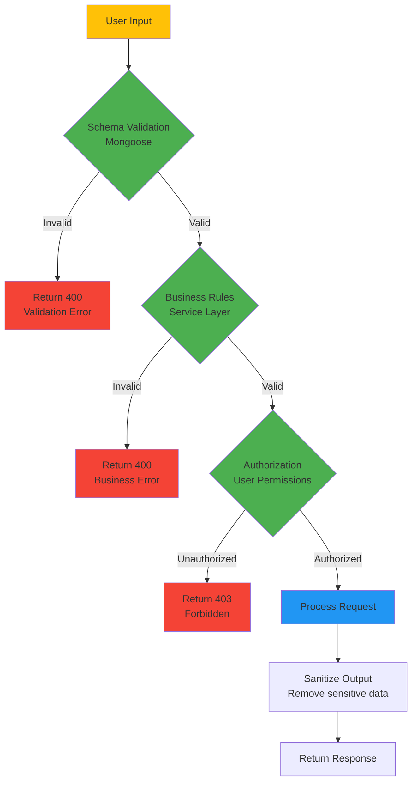

---

## 7. DATA FLOW DIAGRAMS

### 7.1. User Registration Data Flow

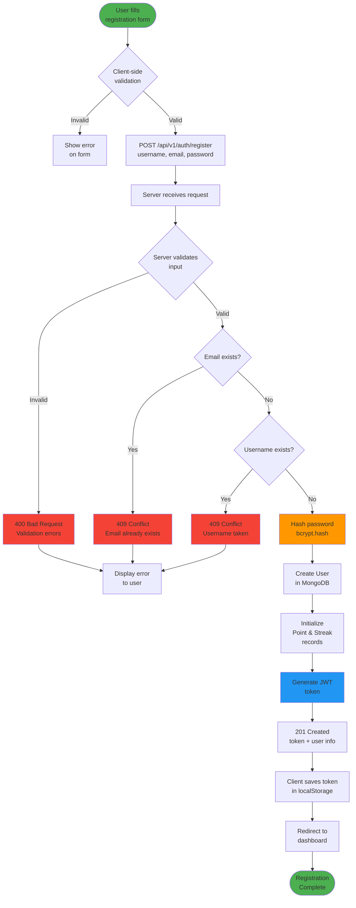

### 7.2. Quiz Submission Data Flow

```mermaid
graph TB
    Start([User submits<br/>quiz answers])
    
    Start --> PrepareData[Prepare request<br/>topicId + answers[]]
    
    PrepareData --> AddToken[Add JWT token<br/>to headers]
    
    AddToken --> SendRequest[POST /api/v1/quizzes/submit]
    
    SendRequest --> AuthMiddleware{Verify JWT<br/>token}
    
    AuthMiddleware -->|Invalid| Return401[401 Unauthorized]
    AuthMiddleware -->|Valid| AttachUser[Attach user<br/>to req.user]
    
    AttachUser --> ValidateInput{Validate<br/>request body}
    
    ValidateInput -->|Invalid| Return400[400 Bad Request]
    ValidateInput -->|Valid| FetchVocabs[Fetch vocabularies<br/>from database]
    
    FetchVocabs --> CreateMap[Create vocabId → vocab<br/>Map for O1 lookup]
    
    CreateMap --> CompareAnswers[Compare each answer<br/>with correct answer]
    
    CompareAnswers --> CalcScore[Calculate score<br/>correctCount × 10]
    
    CalcScore --> SaveResult[Save QuizResult<br/>to database]
    
    SaveResult --> CallPointService[Call Point Service<br/>addPoints]
    
    CallPointService --> UpdatePoints[Update Points<br/>increment totalPoints<br/>weeklyPoints<br/>monthlyPoints]
    
    UpdatePoints --> CallStreakService[Call Streak Service<br/>updateStreak]
    
    CallStreakService --> CheckLastStudy{Studied<br/>yesterday?}
    
    CheckLastStudy -->|Yes| IncrementStreak[currentStreak++]
    CheckLastStudy -->|No| ResetStreak[currentStreak = 1]
    
    IncrementStreak --> UpdateLongest{currentStreak ><br/>longestStreak?}
    ResetStreak --> UpdateLongest
    
    UpdateLongest -->|Yes| SetLongest[longestStreak =<br/>currentStreak]
    UpdateLongest -->|No| SaveStreak[Save streak<br/>to database]
    SetLongest --> SaveStreak
    
    SaveStreak --> PrepareResponse[Prepare response<br/>with results]
    
    PrepareResponse --> Return200[200 OK<br/>score, correctAnswers<br/>incorrectAnswers<br/>streak info]
    
    Return200 --> ClientReceive[Client receives<br/>results]
    
    ClientReceive --> DisplayResults[Display results<br/>Score animation<br/>Streak update<br/>Show mistakes]
    
    DisplayResults --> UpdateUI[Update UI<br/>Points badge<br/>Streak flame<br/>Leaderboard rank]
    
    UpdateUI --> End([Quiz Complete])
    
    Return401 & Return400 --> ShowError[Display error<br/>to user]

    style Start fill:#4CAF50
    style CompareAnswers fill:#FF9800
    style CalcScore fill:#FF9800
    style IncrementStreak fill:#2196F3
    style DisplayResults fill:#4CAF50
    style End fill:#4CAF50
    style Return401 fill:#F44336
    style Return400 fill:#F44336
```

### 7.3. Leaderboard Query Data Flow

```mermaid
graph LR
    Client[Client Request<br/>GET /leaderboard/total]
    
    Client --> Server[Server receives]
    
    Server --> Query[Query Point collection<br/>sort by totalPoints DESC]
    
    Query --> Index[Use totalPoints index<br/>Fast sorting]
    
    Index --> Paginate[Apply pagination<br/>skip + limit]
    
    Paginate --> Populate[Populate user info<br/>username, email]
    
    Populate --> AddRank[Add rank field<br/>based on position]
    
    AddRank --> Response[Return response<br/>leaderboard + pagination]
    
    Response --> Cache[Cache in Redis<br/>5 minutes TTL]
    
    Cache --> Client

    style Client fill:#4CAF50
    style Index fill:#FF9800
    style Cache fill:#2196F3
```

---

## 8. DEPLOYMENT ARCHITECTURE

### 8.1. Production Deployment

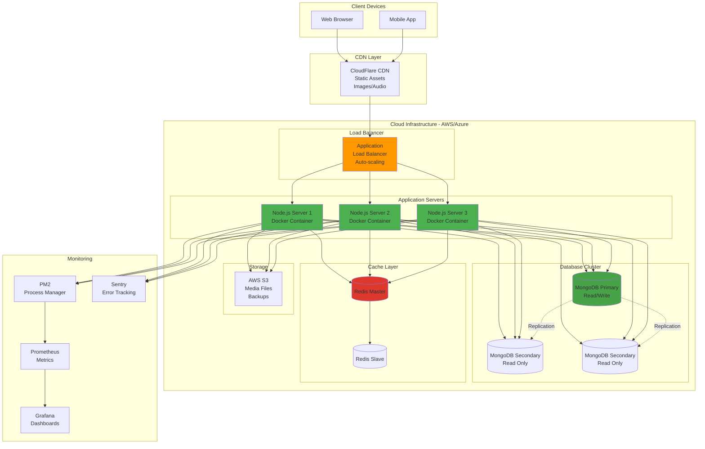

### 8.2. Docker Container Architecture

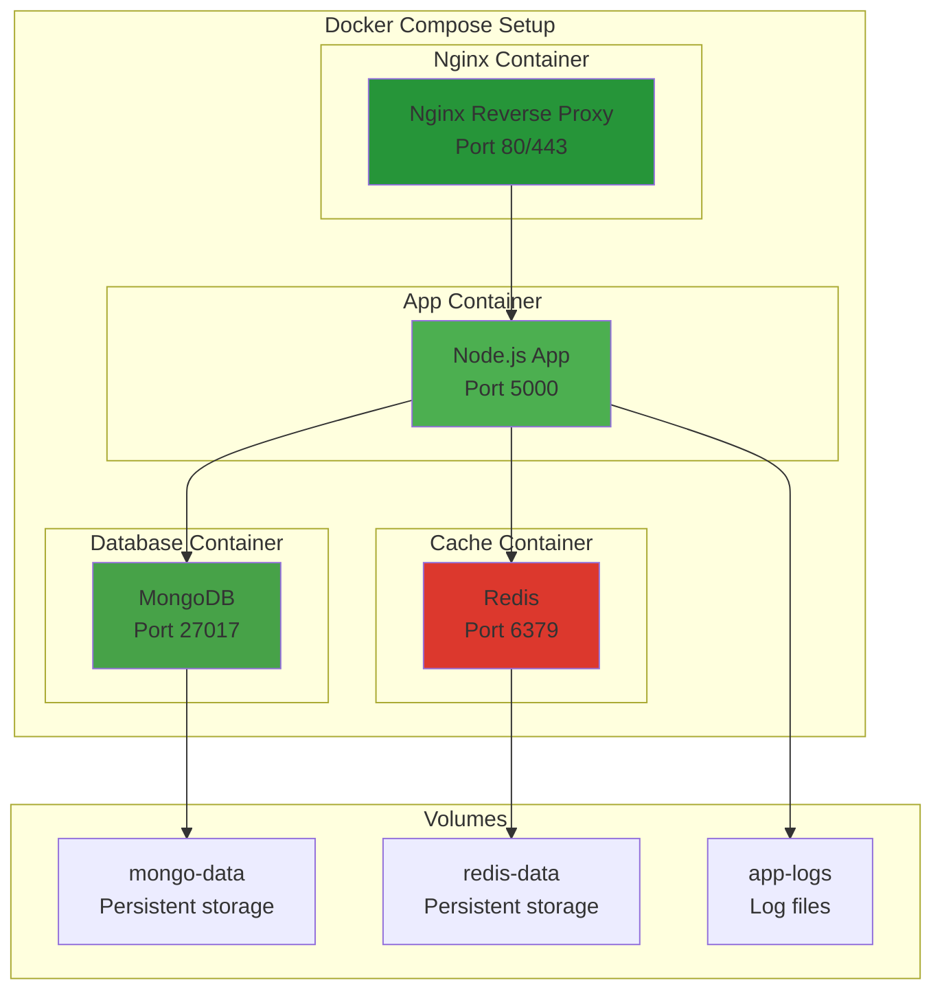

---

## 9. PERFORMANCE OPTIMIZATION

### 9.1. Database Query Optimization

```mermaid
graph LR
    subgraph "Optimization Techniques"
        I1[Indexes<br/>B-tree indexes on<br/>frequently queried fields]
        
        I2[Aggregation Pipeline<br/>Server-side processing<br/>Reduce data transfer]
        
        I3[Lean Queries<br/>Plain JS objects<br/>Skip Mongoose overhead]
        
        I4[Select Fields<br/>Only fetch needed data<br/>Reduce bandwidth]
        
        I5[Pagination<br/>Limit result size<br/>Prevent memory issues]
    end
    
    subgraph "Caching Strategy"
        C1[Redis Cache<br/>Leaderboard: 5 min<br/>Topics: 1 hour]
        
        C2[In-Memory Cache<br/>Hot data in RAM<br/>Node.js cache]
    end
    
    subgraph "Results"
        R1[Fast Response<br/>< 100ms avg]
        R2[Low DB Load<br/>Reduced queries]
        R3[Scalability<br/>Handle high traffic]
    end
    
    I1 & I2 & I3 & I4 & I5 --> R1 & R2 & R3
    C1 & C2 --> R1 & R2 & R3

    style I1 fill:#4CAF50
    style I2 fill:#4CAF50
    style I3 fill:#4CAF50
    style C1 fill:#2196F3
    style C2 fill:#2196F3
    style R1 fill:#FF9800
```

### 9.2. API Response Time Breakdown

```mermaid
gantt
    title API Response Time Analysis (Total: ~150ms)
    dateFormat X
    axisFormat %L ms

    section Network
    Client to Server       :0, 10
    
    section Middleware
    CORS & Auth           :10, 15
    
    section Controller
    Parse & Validate      :15, 10
    
    section Service
    Business Logic        :25, 20
    
    section Database
    Query Execution       :45, 60
    
    section Processing
    Data Formatting       :105, 20
    
    section Network
    Server to Client      :125, 25
```

---

## 10. SCALING STRATEGY

### 10.1. Horizontal Scaling

```mermaid
graph TB
    subgraph "Traffic Growth"
        T1[1K Users<br/>Single Server]
        T2[10K Users<br/>2-3 Servers]
        T3[100K Users<br/>5-10 Servers]
        T4[1M+ Users<br/>Auto-scaling group]
    end
    
    T1 --> T2
    T2 --> T3
    T3 --> T4
    
    subgraph "Strategies"
        S1[Load Balancer<br/>Distribute requests]
        S2[Stateless Apps<br/>No session on server]
        S3[Database Replication<br/>Read replicas]
        S4[Caching Layer<br/>Redis cluster]
        S5[CDN<br/>Static content]
    end
    
    T4 --> S1 & S2 & S3 & S4 & S5

    style T1 fill:#C8E6C9
    style T2 fill:#81C784
    style T3 fill:#66BB6A
    style T4 fill:#4CAF50
```

---

## 📊 TÓM TẮT KIẾN TRÚC

### ✅ Điểm Mạnh Của Kiến Trúc

1. **Layered Architecture** - Tách biệt rõ ràng giữa các layer
2. **RESTful API** - Chuẩn REST, dễ tích hợp
3. **Stateless** - Không lưu session, dễ scale horizontal
4. **JWT Authentication** - Bảo mật, không cần session store
5. **MongoDB Indexes** - Query nhanh với indexes
6. **Error Handling** - Centralized error handling
7. **Validation** - Multi-layer validation (client, server, database)
8. **Modular** - Dễ maintain và extend

### 🎯 Core Features Implemented

- ✅ Authentication & Authorization (JWT)
- ✅ User Management
- ✅ Topics & Vocabularies Management
- ✅ Quiz System với Auto-grading
- ✅ Points & Gamification
- ✅ Streak Tracking
- ✅ Leaderboard System
- ✅ Statistics & Analytics
- ✅ Quiz History

### 🚀 Future Enhancements

- [ ] Redis Caching Layer
- [ ] WebSocket for Real-time features
- [ ] Multiplayer Quiz Mode
- [ ] AI-powered recommendations
- [ ] Advanced Analytics Dashboard
- [ ] Mobile Push Notifications
- [ ] Social Features (Friends, Chat)
- [ ] Achievement/Badge System

---

## 📞 DOCUMENT INFO

**Created by:** Development Team  
**Version:** 1.0.0  
**Last Updated:** March 2, 2026  
**Status:** Production Ready

---

**END OF DOCUMENT**
